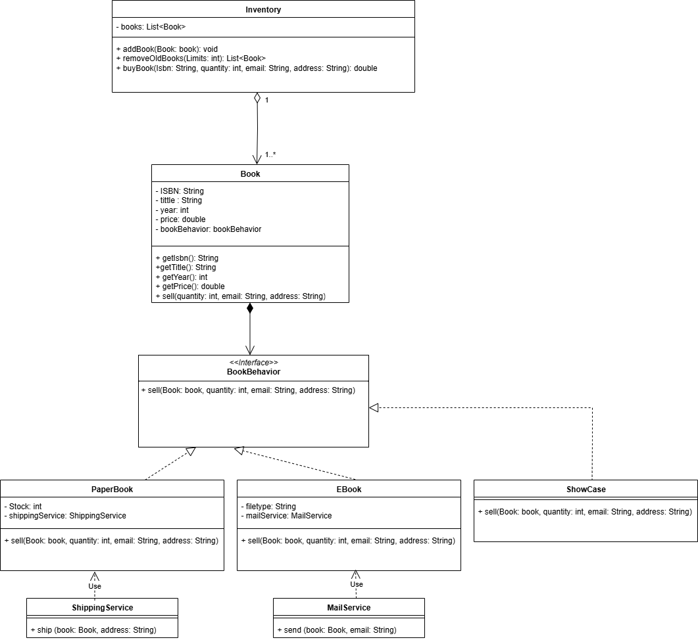
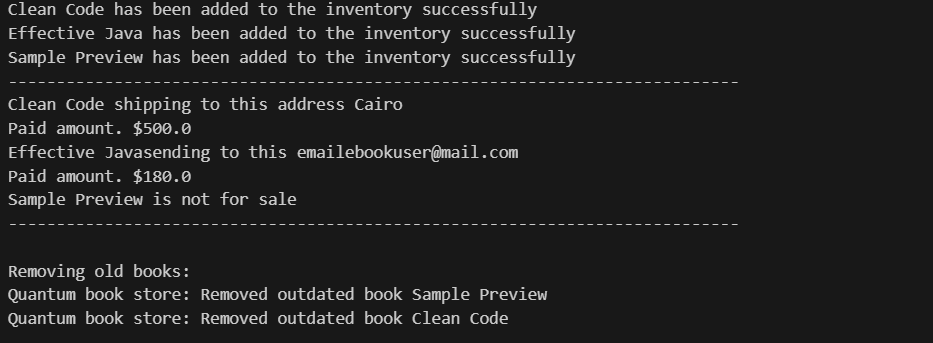

# Quantum Book Store System

This project simulates a basic extensible online bookstore system that supports multiple book types and operations like buying, adding, and removing outdated books.

---

## Features
    . Add books with: ISBN, title, author, year, price
    . Remove outdated books older than a specified number of years
    . Buy a book by ISBN, quantity, email (for eBooks), and address (for paper books)
    . Buying behavior includes:
        . Reducing stock if applicable
        . Throwing an error if out of stock or not for sale
        . Using the correct delivery service:
            . ShippingService → Paper books
            . MailService → EBooks
        . Returning the total price paid

---

## Project Structure
    src/
    ├── model/
    │ ├── Book.java
    │ ├── Inventory.java
    ├── behavior/
    │ ├── BookBehavior.java
    │ ├── PaperBook.java
    │ ├── EBook.java
    │ ├── ShowCase.java
    ├── service/
    │ ├── ShippingService.java
    │ ├── Mailservice.java
    images/
    ├── UML_digram.png ← UML diagram image
    ├── Output_Sample.pnd ← Output sample image
    README.md

---

## How to Run

1. Clone this repo or download the source
2. Open it in **Visual Studio Code (blue one)** or any Java IDE
3. Ensure your `Main.java` contains:
   - Creating sample books
   - Adding book to the inventory
   - Remove old book from inventory
   - Buying a book

---

## UML Class Diagram

  

  ---

## Sample Output
    

---

## Package Naming

  - `model` → All core domain classes (Book, Inventory, etc.)
  - `behavior` → Interfaces or abstract behaviors shared by products  
     (e.g. `Book behavior`)
  - `service` → Utility classes like `ShippingService`

---

## 👩‍💻 Author

Made with 💙 by **Yara Hazem**

---
